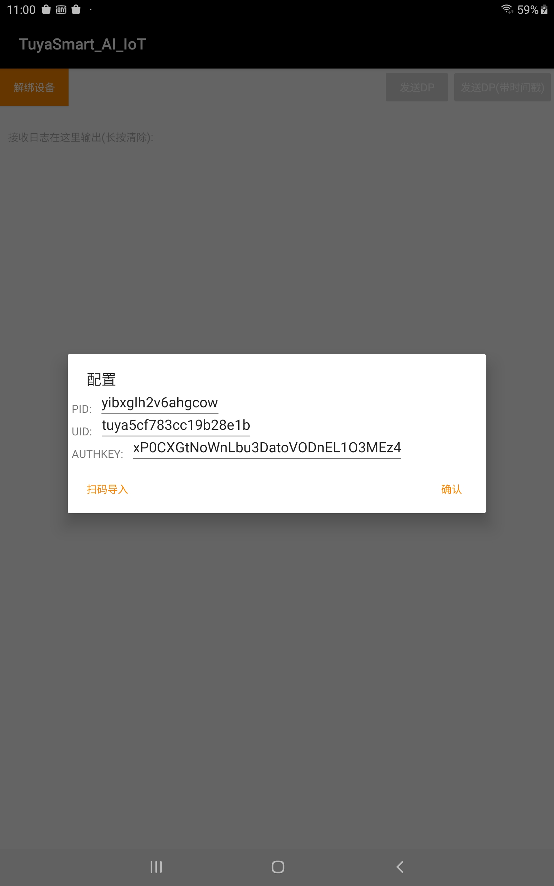
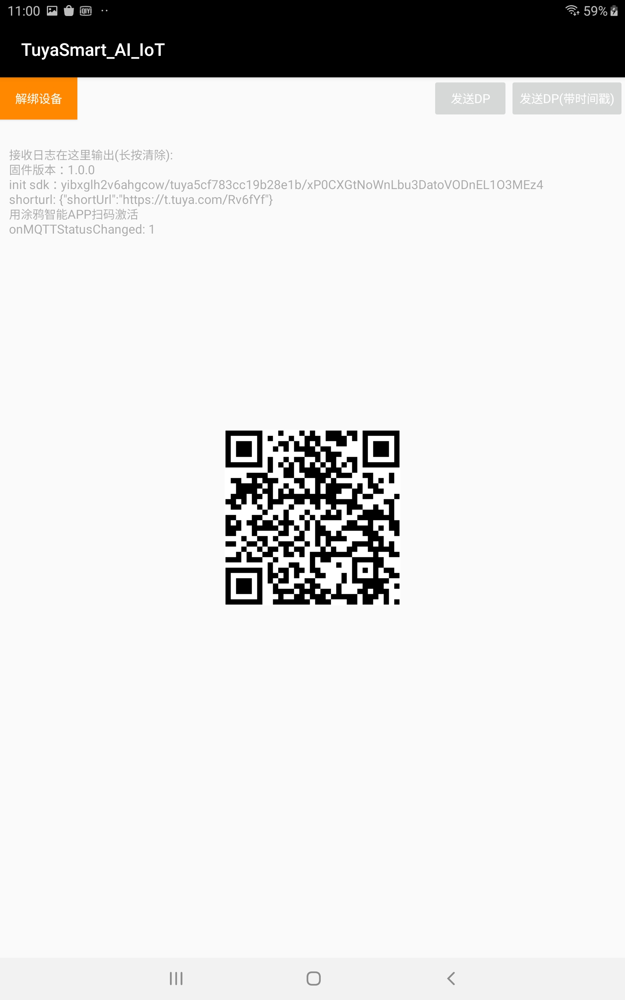
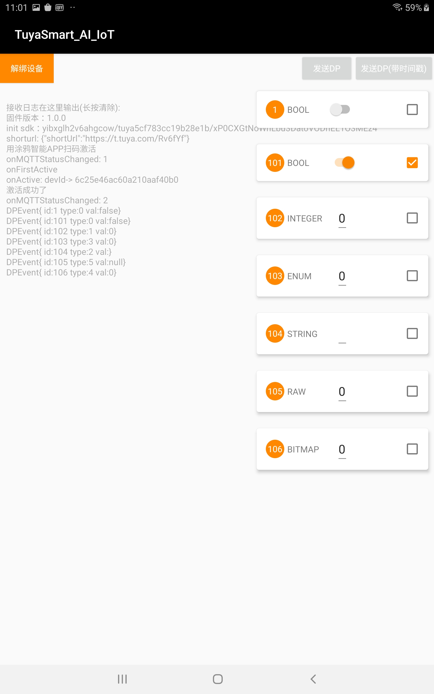

## Android IoT SDK 

<!--[ ](https://bintray.com/tuyasmartai/sdk/tuyasmart-iot_sdk/)-->

### demo使用
demo 提供了获取激活码、激活、dp点测试、状态日志展示等功能。  
[安装包体验](./app/release/app-release.apk)

> **注意** 开始前，需要将激活传入的pid、uuid、authkey配置,

**三种配置方式：**  

1.在你的`local.properties`文件中增加如下（自己编译demo代码使用该方式，直接安装APK请使用后两种）:    

```java
UUID=你的uuid  
AUTHKEY=你的key  
PID=你的pid
```  
2.在配置弹窗中编辑（截图所示）  
3.生成配置二维码，进入demo时扫码（截图所示）  
二维码生成方式：将下面的配置json生成二维码，[生成工具](https://cli.im/text)

```json
{
	"PID": "你的PID",
	"UUID": "你的UUID",
	"AUTHKEY": "你的AUTHKEY"
}
```


  

### 接入

* 依赖

```
implementation 'com.tuya.smart:tuyasmart-iot_sdk:1.0.8'
implementation 'com.tencent.mars:mars-xlog:1.2.3'
```

> 在项目根目录build.gradle中添加仓库地址

```groovy
maven { url 'https://dl.bintray.com/tuyasmartai/sdk' }
```

* 混淆  
如果开启了混淆，在proguard-rules.pro文件中添加
```
-keep class com.tuya.smartai.iot_sdk.** {*;}
-keep class com.tencent.mars.** {*;}
```

* 权限要求

```java
<uses-permission android:name="android.permission.INTERNET" />
<uses-permission android:name="android.permission.WRITE_EXTERNAL_STORAGE" />
<uses-permission android:name="android.permission.READ_EXTERNAL_STORAGE" />
```

* 初始化

```java
IoTSDKManager ioTSDKManager = new IoTSDKManager(context);

/**
     * 初始化SDK (注意！ 1.一个uuid不能同时在多个设备上激活；2.同一个进程只能初始化一次，退出时需要杀掉初始化所在进程)
     * @param basePath  存储路径 示例："/sdcard/tuya_iot/"
     * @param productId 产品id
     * @param uuid  用户id
     * @param authKey 认证key
     * @param version 固件版本号（OTA用）
     * @param mCallback SDK回调方法
     * @return
     */
ioTSDKManager.initSDK(String basePath, String productId, String uuid, String authorKey, String version, IoTCallback mCallback);


public interface IoTCallback {

        /**
                 * dp事件接收
                 * @param event
                 * 
                 * 事件值(event.value)
                 * 事件id(event.dpid)
                 * 事件类型(event.type)
                 * DPEvent.Type.PROP_BOOL
                 * DPEvent.Type.PROP_VALUE
                 * DPEvent.Type.PROP_STR
                 * DPEvent.Type.PROP_ENUM
                 * DPEvent.Type.PROP_BITMAP
                 * DPEvent.Type.PROP_RAW
                 */
        void onDpEvent(DPEvent event);

        //解绑设备回调 (请在此处重启APP进程，否则会影响二次配网)
        void onReset();

        //收到配网二维码短链（获取失败时为null）
        void onShorturl(String url);
        
        /**
         * MQTT状态变化
         * @param status IoTSDKManager.STATUS_OFFLINE 网络离线; 
         *               IoTSDKManager.STATUS_MQTT_OFFLINE 网络在线MQTT离线; 
         *               IoTSDKManager.STATUS_MQTT_ONLINE 网络在线MQTT在线
         */
        void onMQTTStatusChanged(int status);
        
        //设备激活
        void onActive();
        
        //设备初次激活
        void onFirstActive();
        
    }

```

* 销毁  

```java
//会进行广播注销等销毁操作
ioTSDKManager.destroy();
```

### 测试
测试阶段建议开启日志服务, sdk的日志会自动保存在你传入的路径, 遇到问题可将日志文件发给开发同学debug。
> **注意** 生产阶段建议去除

```java
/**
     * 开启本地日志服务
     * @param logPath 日志文件保存路径 示例："/sdcard/tuya_log/"
     * @param cacheDays 日志文件缓存天数
     * @return
     */
Log.init(context, logPath, cacheDays);

//刷写日志文件，可以在需要的时候手动触发。isSync : true 为同步 flush，flush 结束后才会返回。 false 为异步 flush，不等待 flush 结束就返回。
Log.flush(isSync)

//销毁本地日志服务, 活动结束或应用退出时调用
Log.close();
```

### API
```java
//本地解绑 (异步操作，解绑成功会进入onReset回调)
IoTSDKManager.reset();

/**
     * 发送dp事件
     * @param id dp id
     * @param type 类型 DPEvent.Type
     * DPEvent.Type.PROP_BOOL   boolean
     * DPEvent.Type.PROP_VALUE  int
     * DPEvent.Type.PROP_STR    string
     * DPEvent.Type.PROP_ENUM   int
     * DPEvent.Type.PROP_RAW    byte[]
     * @param val 值
     * @return
     */
IoTSDKManager.sendDP(int id, int type, Object val)

/**
     * 发送多个dp事件
     *
     * @param events 多个dp类型
     * @return
     */
IoTSDKManager.sendDP(DPEvent... events)

/**
     * 发送dp事件带时间戳
     *
     * @param id   dp id
     * @param type 类型 DPEvent.Type
     * @param val  值
     * @param timestamp 时间戳 单位秒
     * @return
     */
IoTSDKManager.sendDPWithTimeStamp(int id, int type, Object val, int timestamp)


/**
     * 发送多个dp事件带时间戳（时间戳需要赋值在DPEvent.timestamp）
     *
     * @param events 多个dp类型
     * @return
     */
IoTSDKManager.sendDPWithTimeStamp(DPEvent... events)

/**
     * 发送http请求
     * @param apiName 请求api
     * @param apiVersion 版本号
     * @param jsonMsg   参数json
     * @return
     */
IoTSDKManager.httpRequest(String apiName, String apiVersion, String jsonMsg)


//获取设备id
String IoTSDKManager.getDeviceId()

//获取服务器时间
int IoTSDKManager.getUniTime()

//自定义实现网络状态监测，返回值为网络是否离线。SDK已提供默认实现，如无需要不必扩展此方法。
ioTSDKManager = new IoTSDKManager(this) {

            @Override
            protected boolean isOffline() {
                //实现自己的网络状态监测
                return super.isOffline();
            }
        }

```

### OTA
> 版本区分：根据`ioTSDKManager.initSDK `传入的`version`区分固件版本， 打新固件包时修改version（三位数字版本，如：1.2.3）

支持设备端检测升级和APP触发升级，设置下面的回调后，在后台上传新版本固件(请将升级文件压缩为zip格式)。之后会收到更新信息回调，此时就可以触发`ioTSDKManager.startUpgradeDownload `开始升级下载。

```java 
ioTSDKManager.setUpgradeCallback(new UpgradeEventCallback() {
            @Override
            public void onUpgradeInfo(String version) {
                //收到更新信息 版本号：version
                
                //主动触发升级文件下载(收到更新回调后，可以触发)
                ioTSDKManager.startUpgradeDownload();
            }

            @Override
            public void onUpgradeDownloadStart() {
                //开始升级下载回调
            }

            @Override
            public void onUpgradeDownloadUpdate(int i) {
                //下载进度回调 i%
            }

            @Override
            public void upgradeFileDownloadFinished(int result, String file) {
                //下载完成回调，result == 0 表示成功，file 为升级文件压缩包路径（建议安装完成后清除）
            }
        });
```
