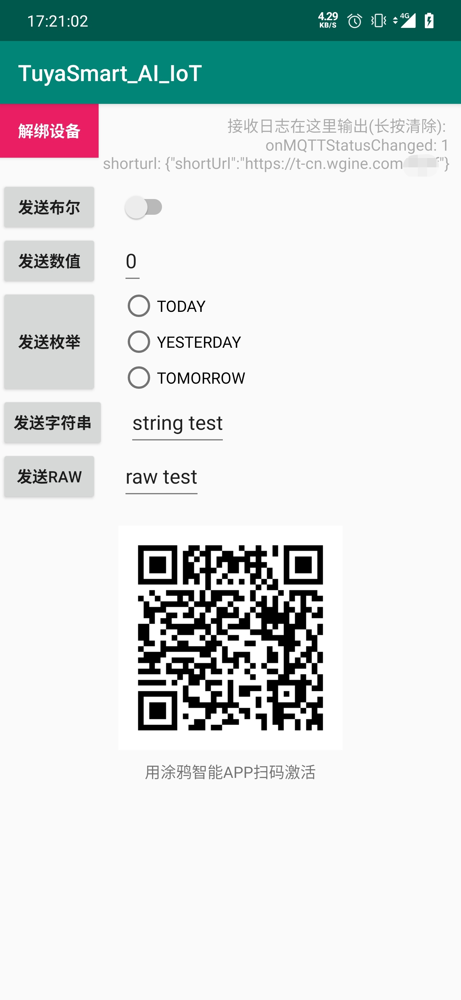

## Android IoT SDK

### demo使用
demo 提供了获取激活码、激活、dp点测试、状态日志展示等功能。
> **注意** 激活需要的pid、uuid、authkey需要在本地配置中填写,
> 在你的`local.properties`文件中增加如下:  
> PRODUCT_ID=你的pid  
> UUID=你的uuid  
> AUTHKEY=你的key



### 接入

* 混淆  
如果开启了混淆，在proguard-rules.pro文件中添加
```
-keep class com.tuya.smartai.iot_sdk.** {*;}
```

* 权限要求

```java
<uses-permission android:name="android.permission.INTERNET" />
<uses-permission android:name="android.permission.WRITE_EXTERNAL_STORAGE" />
<uses-permission android:name="android.permission.READ_EXTERNAL_STORAGE" />
```

* 初始化

```java
IoTSDKManager ioTSDKManager = new IoTSDKManager(context);

/**
     * 初始化SDK (注意！ 一个uuid不能同时在多个设备上激活)
     * @param basePath  存储路径
     * @param productId 产品id
     * @param uuid  用户id
     * @param authKey 认证key
     * @param mCallback SDK回调方法
     * @return
     */
ioTSDKManager.initSDK(String basePath, String productId, String uuid, String authorKey, IoTCallback mCallback);


public interface IoTCallback {

        /**
                 * dp事件接收
                 * @param event
                 * 
                 * 事件值(event.value)
                 * 事件id(event.dpid)
                 * 事件类型(event.type)
                 * DPEvent.Type.PROP_BOOL
                 * DPEvent.Type.PROP_VALUE
                 * DPEvent.Type.PROP_STR
                 * DPEvent.Type.PROP_ENUM
                 * DPEvent.Type.PROP_RAW
                 */
        void onDpEvent(DPEvent event);

        //解绑设备(解绑时需要重启APP进程，否则会影响二次配网)
        void onReset();

        //收到配网二维码短链
        void onShorturl(String url);
        
        /**
         * MQTT状态变化
         * @param status IoTSDKManager.STATUS_OFFLINE 网络离线; 
         *               IoTSDKManager.STATUS_MQTT_OFFLINE 网络在线MQTT离线; 
         *               IoTSDKManager.STATUS_MQTT_ONLINE 网络在线MQTT在线
         */
        void onMQTTStatusChanged(int status);
        
        //设备激活
        void onActive();
        
        //设备初次激活
        void onFirstActive();
        
    }

```

* 销毁  

```java
//会进行广播注销等销毁操作
ioTSDKManager.destroy();
```

### API
```java
//本地解绑
IoTSDKManager.reset();

/**
     * 发送dp事件
     * @param id dp id
     * @param type 类型 DPEvent.Type
     * @param val 值
     * @return
     */
IoTSDKManager.sendDP(int id, int type, Object val)

/**
     * 发送http请求
     * @param apiName 请求api
     * @param apiVersion 版本号
     * @param jsonMsg   参数json
     * @return
     */
IoTSDKManager.httpRequest(String apiName, String apiVersion, String jsonMsg)


//获取设备id
IoTSDKManager.getDeviceId()

//自定义实现网络状态监测，返回值为网络是否离线。SDK已提供默认实现，如无需要不必扩展此方法。
ioTSDKManager = new IoTSDKManager(this) {

            @Override
            protected boolean isOffline() {
                //实现自己的网络状态监测
                return super.isOffline();
            }
        }

```
